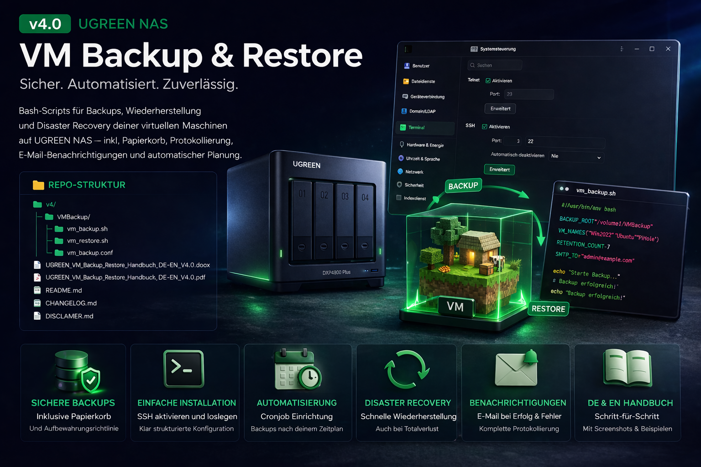

# 🚀 UGREEN NAS VM Backup & Restore v4.0



## 📦 Überblick

Dieses Projekt stellt ein leistungsstarkes Backup- und Restore-System für virtuelle Maschinen auf UGREEN NAS bereit.

✔ Automatisierte VM-Backups  
✔ Disaster Recovery (DR)  
✔ E-Mail Benachrichtigungen  
✔ Cronjob Unterstützung  
✔ Einfache Bash-Skripte  
✔ Deutsch & Englisch  

---

## 📁 Repository Struktur

```
v4/
├── VMBackup/
│   ├── vm_backup.sh
│   ├── vm_restore.sh
│   └── vm_backup.conf
│
├── Screens/
│   └── VMBackupPack.png
│
├── README.md
├── CHANGELOG.md
├── DISCLAIMER.md
│
├── UGREEN_VM_Backup_Restore_Handbuch_DE-EN_V4.0.pdf
```

---

## ⚙️ Installation

### 1. Ordner auf der NAS erstellen

```
/volume1/VMBackup
```

---

### 2. Dateien kopieren

Kopiere den Inhalt aus:

```
VMBackup/
```

nach:

```
/volume1/VMBackup
```

---

### 3. Rechte setzen

```
chmod +x /volume1/VMBackup/*.sh
```

---

### 4. Konfiguration anpassen

Datei:

```
/volume1/VMBackup/vm_backup.conf
```

Wichtige Variablen:

```
BACKUP_ROOT="/volume1/VMBackup"
VM_NAMES="Win2022 Windows11"
MAIL_TO="deine@mail.de"
SMTP_SERVER="smtp.server.de"
```

---

## 🔄 Backup starten

```
cd /volume1/VMBackup
./vm_backup.sh
```

---

## ♻️ Restore starten

```
./vm_restore.sh
```

---

## ⚠️ Disaster Recovery (DR)

Für vollständige Wiederherstellung:

```
./vm_restore.sh --dr
```

➡️ Details siehe Handbuch (PDF)

---

## ⏱️ Cronjob einrichten

```
crontab -e
```

Beispiel:

```
0 3 * * * /volume1/VMBackup/vm_backup.sh >> /volume1/VMBackup/cron.log 2>&1
```

➡️ Läuft täglich um 03:00 Uhr

---

## 📧 Features

- 📦 VM Backup (KVM/libvirt)
- 🔁 Restore einzelner VMs
- 🚑 Disaster Recovery
- 🧠 Automatische VM-Erkennung
- 📧 E-Mail bei Erfolg/Fehler
- 🗂 Logging & Rotation
- 🔐 SSH-basierte Ausführung

---

## 📘 Handbuch

👉 Enthalten im Repository:

```
UGREEN_VM_Backup_Restore_Handbuch_DE-EN_V4.0.pdf
```

---

## 🛠 Troubleshooting

| Problem | Lösung |
|--------|-------|
| Script startet nicht | chmod +x prüfen |
| Keine Mail | SMTP prüfen |
| VM fehlt | VM_NAMES prüfen |
| SSH Fehler | SSH aktivieren |

---

## ⚠️ Disclaimer

Siehe:

```
DISCLAIMER.md
```

---

## 👨‍💻 Autor

Roman Glos  
UGREEN NAS Community

---

## ⭐ Support

Wenn dir das Projekt gefällt:

👉 Star ⭐ auf GitHub  
👉 Feedback willkommen
