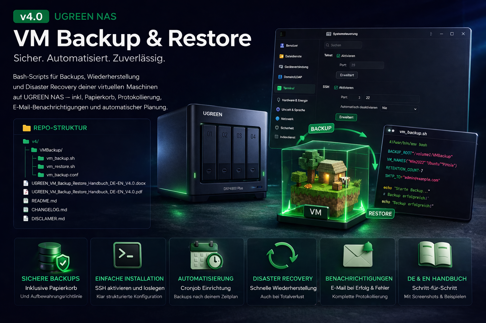

# 🚀 UGREEN NAS VM Backup & Restore



## 📦 Überblick

Dieses Projekt stellt ein leistungsstarkes Backup- und Restore-System für virtuelle Maschinen auf UGREEN NAS bereit.

✔ Automatisierte VM-Backups  
✔ Disaster Recovery (DR)  
✔ E-Mail Benachrichtigungen  
✔ Cronjob Unterstützung  
✔ Einfache Bash-Skripte  
✔ Deutsch & Englisch  

---

## 📁 Repository Struktur

```
v4/
├── VMBackup/
│   ├── vm_backup.sh
│   ├── vm_restore.sh
│   └── vm_backup.conf
│
├── Screens/
│   └── VMBackupPack.png
│
├── README.md
├── CHANGELOG.md
├── DISCLAIMER.md
│
├── UGREEN_VM_Backup_Restore_Handbuch_DE-EN_V4.0.pdf
```

---

## ⚙️ Installation

### 1. Ordner auf der NAS erstellen

```
/volume1/VMBackup
```

---

### 2. Dateien kopieren

Kopiere den Inhalt aus:

```
VMBackup/
```

nach:

```
/volume1/VMBackup
```

---

### 3. Rechte setzen

```
chmod +x /volume1/VMBackup/*.sh
```

---

### 4. Konfiguration anpassen

Datei:

```
/volume1/VMBackup/vm_backup.conf
```

Wichtige Variablen:

```
BACKUP_ROOT="/volume1/VMBackup"
VM_NAMES="Win2022 Windows11"
SMTP_TO="deine@mail.de"
SMTP_SERVER="smtp.server.de"
```

---

## 🆕 Update auf v4.0.1

Neue Sicherungen erhalten Ordnernamen im Format `JJJJ_MM_TT_HH-MM-SS`, zum Beispiel
`2026_09_28_21-30-00`. Bestehende Sicherungen im bisherigen Format `TT_MM_JJJJ_HH-MM-SS`
bleiben beim Restore und bei der chronologischen Aufbewahrung kompatibel. Sie müssen
nicht umbenannt werden.

**Beim Update die eigene `vm_backup.conf` behalten und nicht durch die Beispielkonfiguration überschreiben.**
Für dieses Update genügt der Austausch von `VMBackup/vm_backup.sh`; `vm_restore.sh` ist unverändert.

Die automatische Bereinigung läuft nur nach einem erfolgreichen Backup. Schlägt der
Lauf fehl, bleiben vorhandene Sicherungen erhalten und das Skript liefert Exitcode 1.
Nicht lesbare Datenträgerlisten sowie VMs ohne dateibasierte Datenträger gelten als
Fehler. `RETENTION_COUNT=0` deaktiviert die automatische Löschung; positive ganze
Zahlen legen die Anzahl der aufzubewahrenden Läufe fest. Ungültige Werte deaktivieren
die Bereinigung mit einer Warnung.

Das mitgelieferte Handbuch bleibt auf Stand V4.0. Seine Beispiele mit dem alten
Datumsformat sind weiterhin gültig; für neue Backups den tatsächlichen neuen Ordnernamen verwenden.

---

## 🔄 Backup starten

```
cd /volume1/VMBackup
./vm_backup.sh
```

---

## ♻️ Restore starten

```
./vm_restore.sh Win2022 /volume1/VMBackup/2026_09_28_21-30-00
```

---

## ⚠️ Disaster Recovery (DR)

Für vollständige Wiederherstellung:

```
./vm_restore.sh --dr Win2022 /volume1/VMBackup/2026_09_28_21-30-00
```

➡️ Details siehe Handbuch (PDF)

---

## ⏱️ Cronjob einrichten

```
crontab -e
```

Beispiel:

```
0 3 * * * /volume1/VMBackup/vm_backup.sh >> /volume1/VMBackup/cron.log 2>&1
```

➡️ Läuft täglich um 03:00 Uhr

---

## 📧 Features

- 📦 VM Backup (KVM/libvirt)
- 🔁 Restore einzelner VMs
- 🚑 Disaster Recovery
- 🧠 Automatische VM-Erkennung
- 📧 E-Mail bei Erfolg/Fehler
- 🗂 Logging & Rotation
- 🔐 SSH-basierte Ausführung

---

## 📘 Handbuch

👉 Enthalten im Repository:

```
UGREEN_VM_Backup_Restore_Handbuch_DE-EN_V4.0.pdf
```

---

## 🛠 Troubleshooting

| Problem | Lösung |
|--------|-------|
| Script startet nicht | chmod +x prüfen |
| Keine Mail | SMTP prüfen |
| VM fehlt | VM_NAMES prüfen |
| SSH Fehler | SSH aktivieren |

---

## ⚠️ Disclaimer

Siehe:

```
DISCLAIMER.md
```

---

## 👨‍💻 Autor

Roman Glos  
UGREEN NAS Community

---

## ⭐ Support

Wenn dir das Projekt gefällt:

👉 Star ⭐ auf GitHub  
👉 Feedback willkommen
